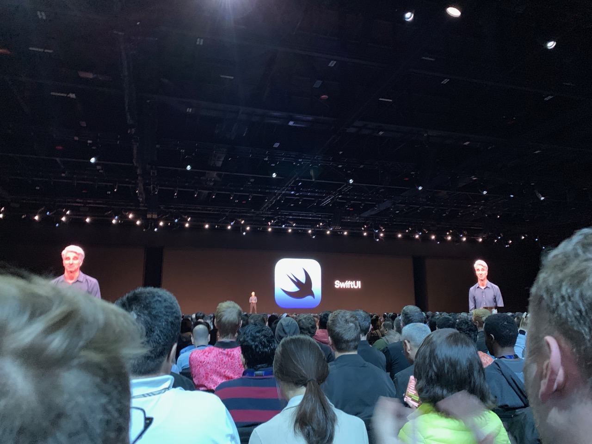

slidenumbers: true
slide-transition: true

# [fit] WWDC 2019

^ What is WWDC

---

# Self Intro

- Joshua Kaplan
- minne iOS @ GMO Pepabo

---

# [fit] Before going

---

1. Check bank account
2. Apply!
3. Pray

^ If you're accepted, Apple charges your card right away

---

# [fit] Day 1

---

# Schedule

- Waiting
- Keynote
- Platform State of the Union
- Design Awards

---

# [fit] Waiting

^ Talking with everyone; energetic Apple Store employees; coffee, fruit, and bread

---

---

---

---

---

# [fit] Keynote

---

- New features for iOS/tvOS/watchOS/macOS
- iPadOS
- Mac Pro and new display
- SwiftUI!!1

^ iPadOS is fundamentally still iOS, but it's a shift toward making iPad more powerful

---

# [fit] New features for iOS/tvOS/watchOS/macOS

---

- Privacy features
- Accessibility features
- Dark mode for iOS
- More Mac-like iPadOS
- iPad apps on macOS

^ Privacy: location tracking, Sign In with Apple; easy to implement Accessibility; dark mode like on macOS; iPad with full desktop browser, more powerful multitasking, mouse support; Project Catalyst as announced last year

---

# [fit] Mac Pro and New Display

---

- Looks fast
- 6K resolution/price
- $1,000 stand

^ Super high specs, aimed at upper end Pro market

---

# [fit] SwiftUI

---

- Complete paradigm shift
- imperative to declarative functional reactive
- End of NextStep era (IB, Obj-C, UIKit)

^ What NextStep/NS is; Much like React, but with advantages only Apple has in controlling the entire stack

---

---

---

^ That guy's reaction: OMG

---

# [fit] Platform State of the Union

^ Apple announces new developer related info

---

- Xcode Previews
- Combine (reactive programming framework)
- Swift Package Manager support
- Great improvements to UICollectionView/UITableView

---

---

---

---

---

---

---

# Design Awards

^ Honoring great apps; No Mac apps this year

---

# [fit] Days 2-5

---

- Sessions
- Labs
- Side events

^ Session=lecture; Labs are face2face w/ engineers, designers, App Store reviewers; side events official and non-official alike; Apple employee introduced me to Japanese language Bay Area meetup

---

# [fit] Sessions

---

---

# Labs

---

# [fit] Side events

---

# Workouts

---

# [fit] Unofficial events

---

# [fit] Parties & Concerts

---

---

---

---

---

---

# [fit] Questions

